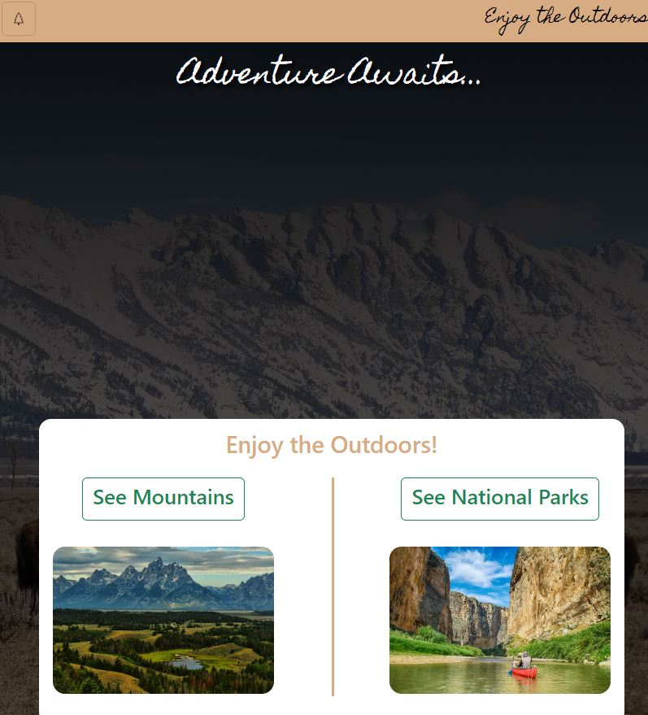
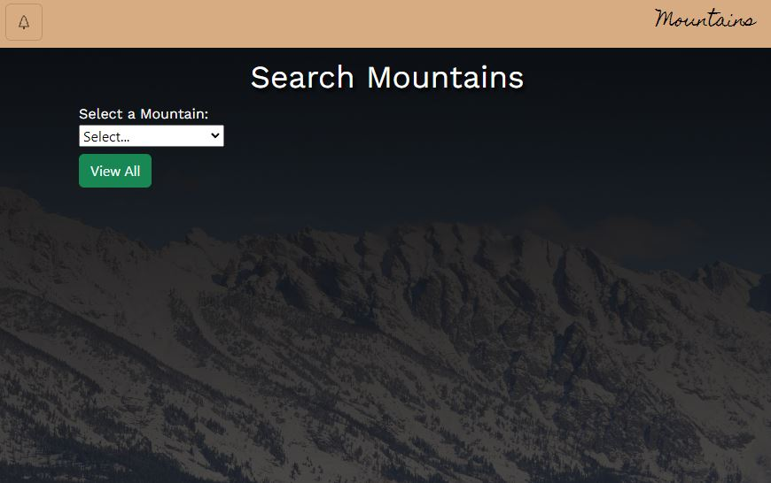
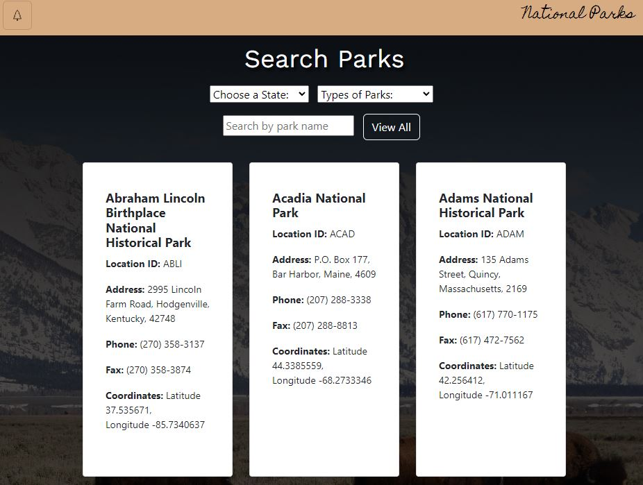

# Capstone2_Enjoy_The_Outdoors
 
I have made a simple 3 page website utilitizing search and display features in Javascript. The homepage consists of simple divs with a navbar and 2 buttons to direct the user to the search pages. 

The Mountains page contains a search and view all button to display all the mountain cards. I added an overflow-y and max-height vh so you can scroll through the cards without scrolling down the page. 

The National Parks page features 3 different ways to filter the cards created with JS arrays. I added a feature that closes the results after you click off of them, but it created tonnes of conflicts and headaches that took a bit to sort out, but I think with the right implementation it could be a very handy feature! 
